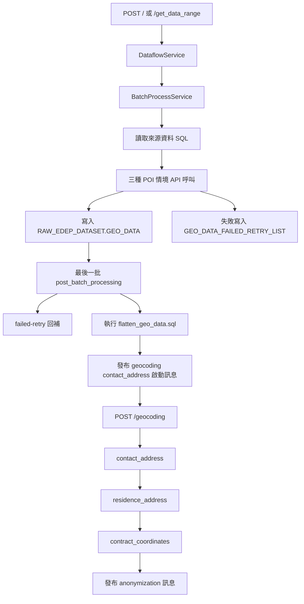

# Geo Data Resolver

本專案是一個以流程編排為核心的 Flask 服務，將地理資料處理拆成兩段：

1. Place Aggregate 批次流程（POI 計數）
2. Geocoding 三階段流程（地址與座標標準化）

README 僅描述程式流程與行為，不涵蓋部署或基礎設施細節。

## 系統流程總覽



## 流程 1: Place Aggregate 批次

### 觸發入口

- `POST /`
  - Daily 模式。
  - 由 `DataflowService.handle_daily_request()` 進入。
- `POST /get_data_range`
  - Range 模式，需帶 `start_date`、`end_date`。
  - 由 `DataflowService.handle_date_range_request()` 進入。

### 批次處理規則

- 每次載入資料後交由 `BatchProcessService._process_single_batch()`。
- 一筆資料會依序執行三種 POI 情境：
  - `corporate_finance`
  - `residential`
  - `commercial`
- 若任一情境 API 例外：
  - 寫入 `GEO_DATA_FAILED_RETRY_LIST`
  - 該筆不寫入 `GEO_DATA`
- 只有三個情境都成功（即使某些為座標無效回傳 `"null"`）才會組裝 `raw_data.scenario_counts` 寫入 RAW 表。

### 批次回呼

- 非最後一批：發佈 Pub/Sub recall 訊息，觸發下一批。
- 最後一批：進入 `post_batch_processing()`。

### 最後一批後處理

- 載入 failed-retry 清單並分批回補。
- 執行 `sql/flatten_geo_data.sql`，將 RAW 資料映射到 `TRANS_EDEP_DATASET.TMP_GEO_DATA`。
- flatten 成功後，發佈 geocoding 第一階段（`contact_address`）啟動訊息。

## 流程 2: Geocoding 三階段

### 入口

- `POST /geocoding`
  - 由 `GeocodingFlowService.handle_geocoding_request()` 處理。
  - 可接手動請求或 Pub/Sub Push 訊息。

### 三階段順序

1. `contact_address`
2. `residence_address`
3. `contract_coordinates`

每個階段都由 `GeocodingBatchProcessService.process_stage()` 執行：

- 每批次都會先跑對應 update SQL（先補入可直接重用的歷史結果）。
- 接著跑 query SQL 取本階段待查資料。
- 逐筆呼叫 Geocoding API 並驗證回應。
- 成功結果寫入 GCS 與 `RAW_EDEP_DATASET.GEOCODING`。
- 非最後一批發佈同階段 recall。
- 階段最後一批完成後自動切下一階段。

當 `contract_coordinates` 階段完成：

- 發佈 anonymization 訊息，payload 為 `{"file_list": ["RAW_EDEP_DATASET.GEOCODING"]}`。

## API 行為

### 1) `POST /`

- 用途：啟動 Daily Place Aggregate 批次。
- 成功：`200`（一般 HTTP 呼叫）或 `204`（Pub/Sub Push 呼叫成功）。

### 2) `POST /get_data_range`

- 用途：啟動指定日期區間批次。
- 必填：`start_date`, `end_date`。
- 成功：`200` 或 `204`（Pub/Sub Push）。

### 3) `POST /geocoding`

- 用途：執行 geocoding 階段批次與回呼。
- 常見 payload：

```json
{
  "processing_params": {
    "task_type": "contact_address",
    "batch_number": 1
  }
}
```

- 成功：`200` 或 `204`（Pub/Sub Push）。

## 主要程式流程對照

- 路由入口：`blueprints/geo_routes.py`
- Place Aggregate 流程：`services/dataflow_service.py`
- Place Aggregate 批次核心：`application/batch_process_service.py`
- Geocoding 流程：`services/geocoding_flow_service.py`
- Geocoding 批次核心：`application/geocoding_batch_process_service.py`
- API 封裝：`services/google_maps_api_service.py`
- SQL：`sql/`

## SQL 任務切分

### Place Aggregate SQL

- `sql/get_geo_query_data.sql`
- `sql/get_geo_query_data_range.sql`
- `sql/failed_retry_list.sql`
- `sql/flatten_geo_data.sql`

### Geocoding SQL

- `sql/geocoding_update_contact_address.sql`
- `sql/geocoding_query_contact_address.sql`
- `sql/geocoding_update_residence_address.sql`
- `sql/geocoding_query_residence_address.sql`
- `sql/geocoding_update_contract_coordinates.sql`
- `sql/geocoding_query_contract_coordinates.sql`


## 補充說明

- Pub/Sub Push 格式訊息若處理成功，路由會回 `204`。

- Geocoding 流程中，`REQUEST_DENIED` 與 `UNKNOWN_ERROR` 視為致命錯誤，會中斷該批流程。
- Place Aggregate 的 failed-retry 為「先主流程後回補」，並在下一輪批次前更新成功狀態。

- **Pub/Sub Filter `!=` 語意陷阱**：GCP Pub/Sub filter 中，`attributes.key != "val"` 在 attribute **不存在**時同樣回傳 TRUE，導致不帶該 attribute 的訊息意外通過篩選。例如 geocoding 訊息只帶 `{category: "geocoding"}`，不含 `start_date`/`end_date`，會意外觸發 filter 為 `attributes.start_date != "" AND attributes.end_date != ""` 的訂閱項目。因此各訂閱項目的 filter 應使用 `=` 明確匹配。
