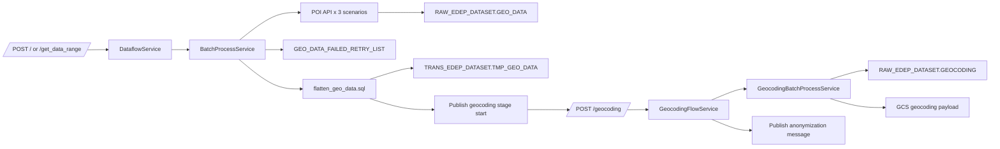

# Geo Data Resolver Architecture

本文件說明目前程式實際執行架構，聚焦流程責任與資料流向。

## 1. 兩段式處理架構

系統由兩段流程組成：

1. Place Aggregate 批次流程
2. Geocoding 三階段流程

## 2. 組件責任

### 2.1 路由層

- `blueprints/geo_routes.py`
  - `POST /`
  - `POST /get_data_range`
  - `POST /geocoding`
  - 若為 Pub/Sub push 且處理成功，統一回 `204`。

### 2.2 Place Aggregate 服務層

- `services/dataflow_service.py`
  - 決定 Daily/Range 模式。
  - 處理 recall message (`daily_recall`, `range_recall`)。
  - 建立 `BatchContext` 並交給批次核心。

- `application/batch_process_service.py`
  - 載入來源 SQL。
  - 單筆資料執行三情境 POI 呼叫。
  - 成功資料寫 RAW，失敗寫 failed-retry。
  - 最後一批執行 failed-retry 回補與 flatten。
  - flatten 成功後啟動 geocoding 第一階段。

### 2.3 Geocoding 服務層

- `services/geocoding_flow_service.py`
  - 驗證 `task_type` 與 `batch_number`。
  - 管理階段切換：
    - `contact_address -> residence_address -> contract_coordinates`
  - 最終發布 anonymization 訊息。

- `application/geocoding_batch_process_service.py`
  - 每個 batch 都先跑 update SQL。
  - 再跑 query SQL 取得待處理資料。
  - 呼叫 Geocoding API，驗證回應後寫入 BQ/GCS。
  - 非最後一批發布同階段 recall。

### 2.4 API 封裝

- `services/google_maps_api_service.py`
  - 封裝 POI 與 Geocoding 呼叫。
  - 寫入 API log、維護 metrics。
- `infrastructure/google_maps_client.py`
  - 真正對外 HTTP 呼叫。
  - QPM 速率限制、重試、回應解析。

## 3. 批次狀態與回呼

- `BatchContext.is_last_batch = (batch_size > 當前資料筆數)`。
- 非最後一批：發布 recall 訊息。
- 最後一批：執行 post-batch（Place Aggregate）或階段切換（Geocoding）。

## 4. 資料輸出

- `RAW_EDEP_DATASET.GEO_DATA`
  - `raw_data.scenario_counts` 保存三情境 POI 計數。
- `RAW_EDEP_DATASET.GEO_DATA_FAILED_RETRY_LIST`
  - 記錄失敗情境與失敗原因。
- `TRANS_EDEP_DATASET.TMP_GEO_DATA`
  - flatten 後供下游使用的扁平欄位。
- `RAW_EDEP_DATASET.GEOCODING`
  - 三階段 geocoding 的標準化結果。

## 5. 例外規則

- POI 流程：單情境失敗時，整筆不寫 RAW。
- Geocoding 流程：
  - `REQUEST_DENIED`、`UNKNOWN_ERROR` 視為致命錯誤。
  - 其他錯誤以單筆跳過方式繼續。
